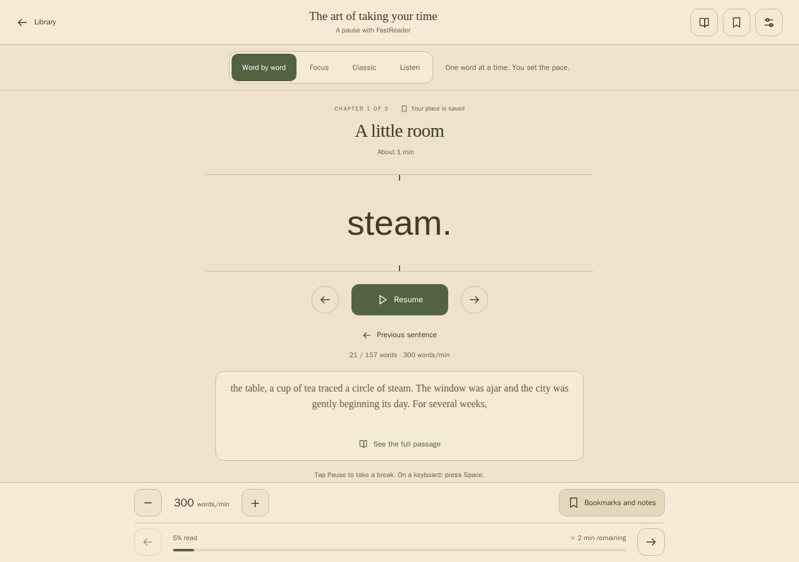

# FastReader

**Read faster. Finish the books you start.** FastReader turns your EPUBs into a focused reading experience: one word at a time, at the pace you choose. Make progress through your reading list on your phone, tablet or computer.

## [Start reading →](https://drslid.github.io/EPUB-FastReader/en.html)

**Free to use. No account required. Open it in your browser and try a book before importing anything.**

[🇬🇧 English](https://drslid.github.io/EPUB-FastReader/en.html) · [🇫🇷 Français](https://drslid.github.io/EPUB-FastReader/?lang=fr) · [🇪🇸 Español](https://drslid.github.io/EPUB-FastReader/es.html) · [🇮🇹 Italiano](https://drslid.github.io/EPUB-FastReader/it.html) · [🇩🇪 Deutsch](https://drslid.github.io/EPUB-FastReader/de.html) · [🇵🇹 Português](https://drslid.github.io/EPUB-FastReader/pt.html)

*Word by word mode, shown with the built-in demonstration.*

## From your reading list to the last page

1. **Try it:** open FastReader and tap **Try the reader** for an instant demonstration.
2. **Choose your book:** browse **Discover**, search by title or author, or tap **Import an EPUB** to open a file you already have.
3. **Start reading:** tap **Read** on a supported catalogue result. The book opens in the reader and joins **My library** automatically.
4. **Find your pace:** press play in **Word by word**, adjust the speed, and pause or go back whenever you need to.
5. **Pick up later:** open the book from **My library** to return to your reading position.

Search looks through your own books and the catalogues together. Your books come first; catalogue results arrive as each source responds. All book languages are included by default, and you can narrow the search with the language and source filters.

## Three ways to keep reading

| Mode | What it does | How to use it |
| --- | --- | --- |
| **Word by word** | Shows one word at a time in a steady position. | Set your words per minute, choose a Gentle or Steady cadence, and use pause or previous sentence to stay with the text. |
| **Focus** | Emphasizes the beginning of words while keeping the whole passage visible. | Adjust how much of each word is emphasized, with an option to leave short words unchanged. |
| **Classic** | Displays the full text for ordinary reading. | Scroll at your own pace and move through the book with the table of contents. |

Books open in Word by word, ready for you to press play. If your device requests reduced motion, they open in Classic instead. You can switch modes while reading.

The aim is to help you spend more time reading and make steady progress. Choose a speed that lets you follow the story; a higher setting does not guarantee better understanding.

## Make reading comfortable

FastReader starts with a **sepia theme and Verdana**. Use the theme button to cycle through sepia, dark and light, or open the reading settings to find your preferred setup.

- **See changes immediately:** preview font size, line spacing, text width and Focus intensity before returning to your book.
- **Choose your font:** Verdana, Arial, Georgia, Palatino, Trebuchet MS or your device’s default font.
- **Keep your place:** saved progress, bookmarks, highlights and notes help you find a passage again.
- **Read comfortably on a phone:** accessible controls, a fixed word display, an optional screen wake lock and a table of contents within reach.
- **Use a keyboard:** Space plays or pauses Word by word, left and right arrows change chapters, and Escape closes the open panel. Shortcuts leave text fields and buttons available for normal use.

## Bring your books anywhere

**My library** contains the books you import or open from a catalogue. Home suggestions and the demonstration stay separate until you choose a book to read.

To keep reading without a connection, open **Install the app** and follow the instructions for your browser. Wait until FastReader is ready offline, then open the books you want to take with you. New catalogue searches and downloads need an internet connection.

Use **Download EPUB** in your library to save a Classic edition without added Focus emphasis. If a source requires an unchanged edition, its original EPUB is preserved. Import supports EPUB files without DRM, up to 30 MiB. Books with complex fixed layouts or interactive content may display differently from the publisher’s edition.

## Keep a backup of your library

Your books, reading positions, notes and preferences stay in the browser you use. You do not need an account, and personal EPUB imports are not uploaded to a server.

1. Open **Backup**.
2. Choose **Export my backup** and keep the downloaded ZIP somewhere safe.
3. To move to another device or recover your library, open FastReader there and restore the ZIP from the same panel.

A backup can contain up to 500 books and 250 MiB. Restoring keeps the books already present and lets you choose whether to restore reading settings too.

Phone and computer libraries are separate until you transfer a backup. Keep one before clearing browser data, switching browsers or replacing your device. Private browsing is unsuitable for keeping a library between visits.

## Find your next book

Discover brings supported catalogues into one search, with the title, author, cover when available, and source shown for each result. Tap **Read** to open an available EPUB; there is no separate download-and-import step.

| Book source | Book languages | What you can explore |
| --- | --- | --- |
| [Project Gutenberg](https://www.gutenberg.org/) | Multiple languages | A broad catalogue of classic literature. |
| [Standard Ebooks](https://standardebooks.org/ebooks) | English | Carefully edited classics with illustrated covers. |
| [Ebooks libres et gratuits](https://www.ebooksgratuits.com/ebooks.php) | French | Free French EPUB editions, searchable by title. |
| [Faded Page](https://www.fadedpage.com/) | English | Books made available under Canadian copyright rules. |
| [epubBooks](https://www.epubbooks.com/) | English | Classic books with covers and direct EPUB reading. |
| [Ebookzy](https://ebookzy.com/) | English | Search by title or author and open an available EPUB. |
| [Loyal Books](https://www.loyalbooks.com/) | Multiple languages, including English | Live Google-powered search in a separate Loyal Books panel. Tap Read on a book result to open its available EPUB. |

Search starts with **All languages**. Use the language filter where available. Covers are retained when you add a book to your library, including for offline reading when its artwork is available.

Select **Loyal Books** to search beyond the other catalogues using the same search bar. Its panel searches all languages through Google, without FastReader’s former 499-book selection. It retains Google’s result links, pagination, attribution and any ads. Some results are audio feeds or other pages without an EPUB; Read checks the selected book’s EPUB before opening it. Google’s search component loads only when you search in this panel; it is separate from the combined catalogue results.

[BDEbooks](https://bdebooks.com/en/ebooks/) was also evaluated, but its access protection currently prevents us from verifying direct reading in FastReader. It is not included in the connected catalogues. You can still import an EPUB you have obtained from that site.

Open **Settings → Book sources** to check which catalogues are responding. A slow or unavailable source does not prevent you from using your library or the other results. Some providers apply shared download limits; if one is reached, FastReader explains it and you can use another source or import an EPUB you already have.

Book availability and copyright vary by country. Download only editions that are in the public domain where you live or that you are authorized to use. Each book keeps its own rights and credits. External searches are sent to the selected catalogues and, where necessary, FastReader’s catalogue service. Searches in the Loyal Books panel are sent to Google. Your EPUBs, personal notes and reading progress remain in your browser.

## Need a hand?

- **New to the reader?** Open **Home → Three modes: how do I get started?** for a short guide, or try the demonstration.
- **An import failed?** Check that the file is an EPUB without DRM and below 30 MiB. The error message explains what FastReader could not open.
- **A source is unavailable?** Refresh its status, try another catalogue or import a file you already have permission to read.
- **Found a problem or have an idea?** [Tell us on GitHub](https://github.com/drslid/EPUB-FastReader/issues).

FastReader is free and open source under the [MIT license](LICENSE). Books retain their own licenses.
